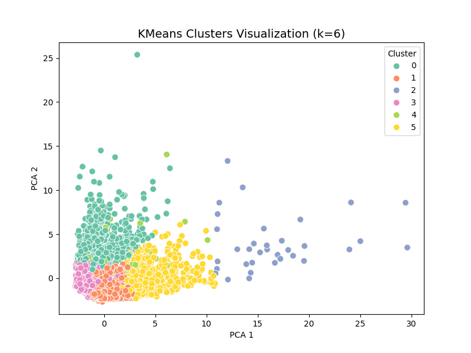
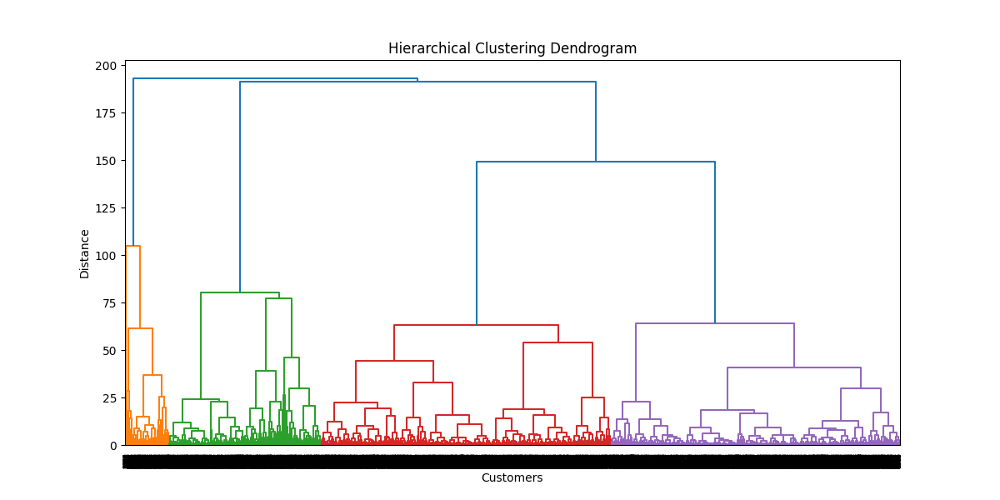
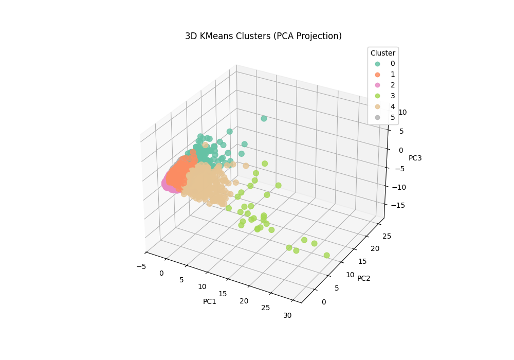
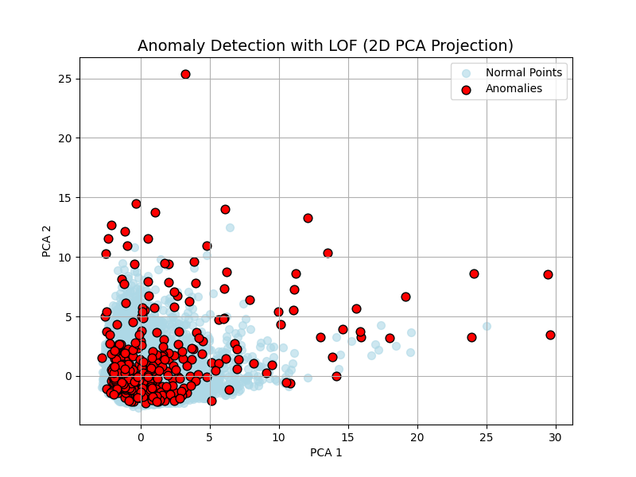
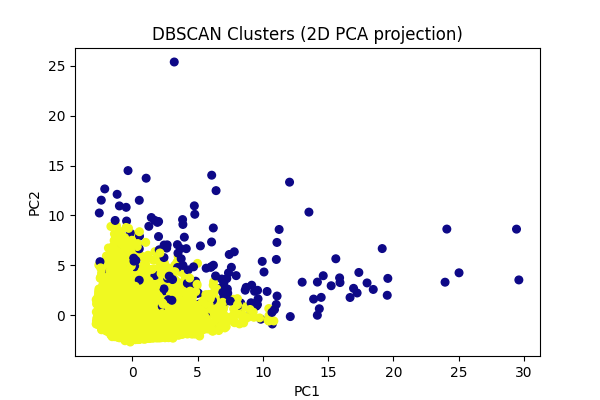
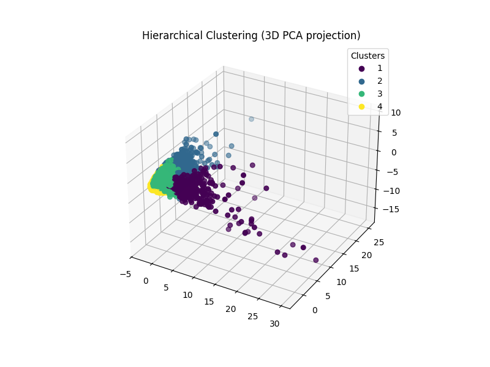
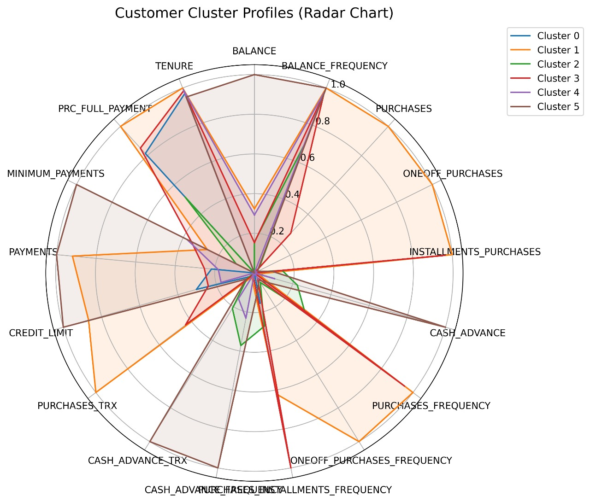
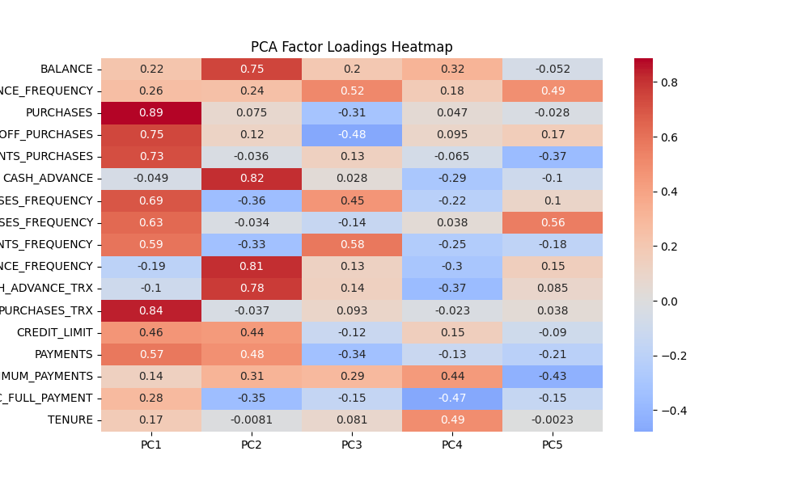

# 🧩 Customer Segmentation with Unsupervised Learning
## 📌 Overview
This project applies unsupervised machine learning techniques (K-Means, DBSCAN, Hierarchical Clustering) on the Credit Card Dataset to identify customer segments based on spending and income behavior.
The goal is to provide business insights that can help in targeted marketing, customer retention, and personalized offers.

### PPT
For better understanding,please refer this presentation
[View Project Presentation (PDF)](reports/Unsupervised_ppt.pdf) 

## 📊 Dataset
Source: UCI / Kaggle Credit Card Dataset
Features: Income, Spending Score, Balance, Purchases, etc.
Size: ~9000 records
Target: No labels (unsupervised task)
[click here](https://www.kaggle.com/datasets/arjunbhasin2013/ccdata)

## 🛠️ Methods Used
Data preprocessing (scaling, handling missing values)
Dimensionality reduction with PCA (for visualization)
Clustering Algorithms:
K-Means
DBSCAN

## 📈 Results & Insights









Cluster 1: High Income, Low Spending → Potential premium members
Cluster 2: Low Income, High Spending → Risky customers (possible credit issues)
Cluster 3: Average Income, Balanced Spending → General target group

## 📊 Evaluation Metrics
Silhouette Score
Davies–Bouldin Index
Inertia (for K-Means Elbow Method)

## 🚀 How to Run
1. Clone this repo
   ```bash
   git clone https://github.com/Qwintal/Unsupervised_Learning.git
   cd Unsupervised_Learning
   ```
2. Install dependencies
   ```bash
   pip install -r requirements.txt
   ```
3. Run Jupyter Notebook
   ```bash
   jupyter notebook notebooks/CustomerSegmentation.ipynb
   ```

## 🔍 Key Takeaways
Clustering revealed 3–4 meaningful customer groups.
Businesses can use these clusters for targeted campaigns.
Future improvements: Streamlit app, advanced clustering (Gaussian Mixture Models).

## 📌 Future Work
Streamlit support app
user uploads dataset → choose clustering algorithm → see results.

## 👨‍💻 Author
Ankit U
[click here](https://github.com/Qwintal)
[click here](https://www.linkedin.com/in/ankit-uniyal-143992317/)
